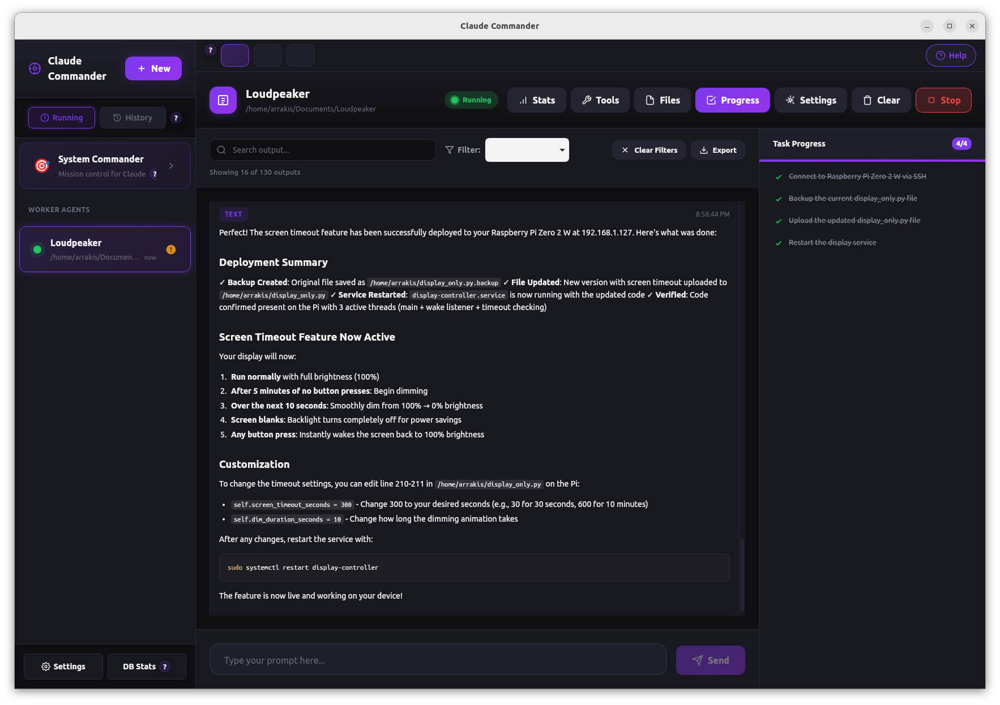

# Claude Commander

[](https://github.com/ClancyDennis/claude-commander/stargazers)
[](LICENSE)


> **Status: Alpha** — Core features work, but expect rough edges. Pre-built binaries coming soon.

**Mission control for Claude Code agents.**

Run dozens of Claude Code agents in parallel. Monitor them in real-time. Track costs across all of them. Let the meta-agent orchestrate complex multi-step workflows while you focus on what matters.



---

## Why Claude Commander?

Running Claude Code agents at scale creates challenges:

| Challenge | Without Claude Commander | With Claude Commander |
|-----------|--------------------------|----------------------|
| **Multiple agents** | Juggle terminal windows, lose track | Unified dashboard, see all at once |
| **Long tasks** | Context overflow kills the session | Automatic compaction keeps it running |
| **Cost tracking** | Check Anthropic dashboard manually | Real-time per-agent breakdown |
| **Coordination** | Manual copy-paste between agents | Meta-agent orchestrates everything |
| **Voice control** | Not available | Three voice modes built-in |

**The architecture is designed for parallel, long-running execution:**

- **Isolated agent processes** — Each agent runs in independent async tasks with no shared locks
- **Bounded memory** — 500-event buffer per agent prevents unbounded growth
- **Context management** — Automatic summarization when approaching limits
- **Database persistence** — All outputs survive restarts
- **Real-time hooks** — Tool events stream via HTTP (port 19832)

---

## Key Features

### Agent Management
- **Unlimited parallel agents** — No artificial limits, run as many as your machine handles
- **Real-time output streaming** — See what each agent is doing as it happens
- **Per-agent statistics** — Token usage, cost, duration tracked independently
- **Automatic cleanup** — Stopped agents cleaned up after 5 minutes

### Long-Running Task Support
The meta-agent handles indefinite execution through smart patterns:

- **Sleep-based iteration reset** — Periodic sleep resets the iteration counter, enabling tasks that run for hours
- **Context compaction** — When context hits 75%, a light model summarizes to free space
- **Output compression** — Large tool outputs truncated intelligently (preserves error/success/id fields)
- **Result queue** — Completed agents feed results back asynchronously

### Voice Integration
Three modes powered by OpenAI Realtime API:

| Mode | What it does | Best for |
|------|--------------|----------|
| **Dictate** | Fast voice-to-text transcription | Quick input, voice memos |
| **Discuss** | Two-way conversation with tool access | Collaborative problem-solving |
| **Attention** | Announces task completion, auto-closes | Background monitoring |

- 8 voice options (alloy, ash, ballad, coral, echo, sage, shimmer, verse)
- Server-side voice activity detection for low latency
- Voice commands route through meta-agent for execution

### Meta-Agent (System Commander)
More than a chat interface — it's an orchestrator:

- **Natural language control** — "Refactor these 5 projects to TypeScript" spawns and coordinates agents
- **Persistent memory** — Remembers project context, tech preferences, past decisions
- **Customizable personality** — Adjust strictness, communication style, autonomy level
- **Light model efficiency** — Memory updates, search, and summarization use Haiku (10x cheaper)
- **Interruptible** — User input interrupts sleeping meta-agent immediately

### Security & Cost
- **Three-layer threat detection** — Pattern matching → LLM analysis → behavioral tracking
- **Sudo approval** — Native OS elevation with risk classification
- **Real-time cost tracking** — Per-agent, per-model, with historical analytics
- **Human-in-the-loop** — Review plans before execution

---

## Architecture

```
┌─────────────────────────────────────────────────────────────────┐
│                       Claude Commander                           │
├─────────────────────────────────────────────────────────────────┤
│  Meta-Agent (System Commander)                                  │
│  ├─ Tool Loop Engine        40 iterations → sleep → reset → ∞  │
│  ├─ Context Manager         Track tokens, compact at 75%        │
│  ├─ Memory Manager          Persistent context (2000 tokens)    │
│  └─ Light Model Sub-Agents  Memory, search, summarization       │
├─────────────────────────────────────────────────────────────────┤
│  Agent Manager                                                  │
│  ├─ Per-agent async tasks   stdin/stdout/stderr isolated        │
│  ├─ Output buffers          500 events max, bounded memory      │
│  └─ Statistics tracking     Cost, tokens, duration per agent    │
├─────────────────────────────────────────────────────────────────┤
│  Hook Server (port 19832)                                       │
│  ├─ Tool events             PreToolUse / PostToolUse hooks      │
│  ├─ Execution tracking      Measures tool duration              │
│  └─ Session mapping         Links Claude sessions to agents     │
├─────────────────────────────────────────────────────────────────┤
│  Voice Layer (OpenAI Realtime)                                  │
│  ├─ Dictate                 gpt-realtime-mini, transcription    │
│  ├─ Discuss                 gpt-4o-realtime-preview + tools     │
│  └─ Attention               Auto-timeout task announcements     │
├─────────────────────────────────────────────────────────────────┤
│  Security Monitor                                               │
│  ├─ Pattern matching        Fast regex for known threats        │
│  ├─ LLM analysis            Semantic threat detection           │
│  └─ Expectation tracking    Flags unexpected tool usage         │
└─────────────────────────────────────────────────────────────────┘
```

---

## Quick Start

### 1. Install Claude Code

Claude Commander requires [Claude Code](https://github.com/anthropics/claude-code) to run agents.

```bash
# macOS / Linux
curl -fsSL https://claude.ai/install.sh | bash

# Windows (PowerShell)
irm https://claude.ai/install.ps1 | iex
```

### 2. Get API Keys

- **Required:** [Anthropic API key](https://console.anthropic.com/) for Claude agents
- **Optional:** [OpenAI API key](https://platform.openai.com/) for voice features

### 3. Run Claude Commander

**Download release:** [github.com/ClancyDennis/claude-commander/releases](https://github.com/ClancyDennis/claude-commander/releases)

**Or build from source:**
```bash
git clone https://github.com/ClancyDennis/claude-commander.git
cd claude-commander
npm install

# Configure API keys
cp .env.example .env
# Edit .env: ANTHROPIC_API_KEY=sk-ant-...

npm run tauri dev
```

### 4. Configure API Keys

| Environment | Location |
|-------------|----------|
| Development | `tauri_server/.env` |
| Linux | `~/.config/claude-commander/.env` |
| macOS | `~/Library/Application Support/claude-commander/.env` |
| Windows | `%APPDATA%\claude-commander\.env` |

```bash
# Required
ANTHROPIC_API_KEY=sk-ant-...

# Optional (for voice)
OPENAI_API_KEY=sk-...
```

---

## Voice Modes

### Dictate
Fast voice-to-text using `gpt-realtime-mini`. No tool execution — pure transcription.

**Use cases:**
- Quick text input without typing
- Voice memos and notes
- Drafting messages

### Discuss
Full two-way conversation using `gpt-4o-realtime-preview`. Can execute tools through the meta-agent.

**Use cases:**
- Collaborative debugging
- Hands-free coding sessions
- Complex task discussion

**How it works:**
1. You speak → transcribed
2. AI responds with audio
3. AI can call `talk_to_mission_control` tool
4. Tool routes to meta-agent → executes → responds
5. AI speaks the result

### Attention
Task completion announcements with auto-timeout. Uses `gpt-4o-realtime-preview`.

**Use cases:**
- Background task monitoring
- "Let me know when the build finishes"
- Notification when agents complete

**How it works:**
1. Agent completes a task
2. Attention mode announces the result
3. You can ask follow-up questions
4. Auto-closes after configured timeout (from personality settings)

---

## Memory System

The meta-agent maintains persistent memory across sessions:

**Location:** `~/.local/share/claude-commander/meta-memory/`

```
meta-memory/
├── MEMORY.md          # Main summary (2000 token budget)
├── preferences.md     # Your coding preferences
└── projects/
    └── myproject.md   # Project-specific context
```

**What gets remembered:**
- Tech stack preferences
- Architecture decisions
- Project context
- Past issues and solutions

**How to use:**
- Memory updates automatically when you share preferences
- Or explicitly: "Remember that this project uses PostgreSQL"
- Meta-agent uses Haiku to process memory updates (efficient)

---

## Security Model

### Three-Layer Detection

| Layer | Speed | What it catches |
|-------|-------|-----------------|
| **Pattern matching** | Instant | Known dangerous commands (`rm -rf /`, reverse shells) |
| **LLM analysis** | ~1 sec | Sophisticated attacks, prompt injection |
| **Expectation tracking** | Ongoing | Unusual tool usage for the task |

### Blocked by Default

- Destructive commands: `rm -rf /`, `mkfs`, `dd`
- Reverse shells: `bash -i >&`, `nc -e`
- Sensitive files: `/etc/shadow`, `.ssh/`, credentials
- Privilege escalation: SUID manipulation, sudoers modification

### Sudo Approval

When an agent needs elevated privileges:

1. **Intercept** — Wrapper script catches sudo
2. **Classify risk** — Normal / Suspicious / High-risk
3. **Show dialog** — You see the exact command
4. **Native auth** — OS prompts for password
5. **Execute** — Runs with actual root privileges

| Platform | Elevation | Requirements |
|----------|-----------|--------------|
| Linux | pkexec | Usually pre-installed |
| macOS | osascript | Built-in |
| Windows | gsudo | `winget install gsudo` |

---

## Example Use Cases

### For Everyone
- **"Organize my Downloads folder"** — Sorts by type, renames with dates
- **"Back up photos to OneDrive"** — Uploads, organizes, removes duplicates
- **"Search emails for flight confirmations"** — Finds and summarizes bookings

### For Developers
- **"Refactor this to TypeScript"** — Spawns parallel agents per directory
- **"Review these 5 PRs"** — Agents analyze each PR simultaneously
- **"Set up CI/CD for this repo"** — Creates workflows, configures deployment

### For Power Users
- **"Deploy to Azure"** — Handles build, container, deployment, DNS
- **"Spin up a K8s cluster"** — Creates cluster, configures networking
- **"Monitor AWS costs"** — Sets up tracking and alerts

---

## FAQ

**Q: Do I need programming knowledge?**
No. Describe what you want in plain English.

**Q: How does it handle long-running tasks?**
The meta-agent uses a sleep-based iteration reset pattern. After 40 iterations, it sleeps briefly, which resets the counter. This allows indefinite execution. Context compaction kicks in at 75% usage to prevent overflow.

**Q: How does voice mode work?**
Three modes: Dictate (transcription only), Discuss (two-way with tool access), Attention (task announcements with auto-timeout). All use OpenAI Realtime API with server-side voice detection.

**Q: What's the meta-agent?**
The "System Commander" — an orchestrator that spawns and coordinates Claude Code agents. It maintains persistent memory, has customizable personality settings, and uses light models for efficiency.

**Q: Is my data sent to your servers?**
No. Everything runs locally. The app only communicates with Anthropic/OpenAI APIs directly.

**Q: How much does it cost?**
The app is free and open source. You pay for Claude/OpenAI API usage at standard rates.

**Q: Can it run sudo commands?**
Yes, with your explicit approval. Commands are classified by risk level, and you see exactly what will run before approving.

---

## Keyboard Shortcuts

| Shortcut | Action |
|----------|--------|
| `Ctrl+N` | New Agent/Pipeline |
| `Ctrl+Shift+$` | Toggle Cost Tracker |
| `Ctrl+P` | Toggle Pool Dashboard |
| `Ctrl+Shift+C` | Open Chat View |
| `Escape` | Close dialogs |

---

## Roadmap

### Shipped
- Multi-agent management with real-time streaming
- Meta-agent with persistent memory
- Context compaction and output compression
- Voice modes (Dictate, Discuss, Attention)
- Personality customization
- 4-phase pipeline system
- Security monitoring with prompt injection detection
- Sudo approval with native OS elevation
- Real-time cost tracking per agent/model
- Instruction Wizard for AI-assisted setup
- History agent with filtered output
- Per-agent isolated architecture (no global locks)

### In Progress
- Pre-built binaries for Windows, macOS, Linux

### Planned
- Plugin system for community extensions
- Import/export for configurations

---

## Documentation

| Document | Description |
|----------|-------------|
| [ARCHITECTURE.md](ARCHITECTURE.md) | Technical internals |
| [CONFIGURATION.md](CONFIGURATION.md) | Settings and options |
| [BUILD.md](BUILD.md) | Build instructions |
| [CONTRIBUTING.md](CONTRIBUTING.md) | How to contribute |

---

## Inspired By

- **[Ralph](https://ghuntley.com/ralph/)** by Geoffrey Huntley — The pipeline system is directly inspired by his work
- **[IndieDevDan](https://www.youtube.com/@indiedevdan)** — Multi-phase agent patterns
- **[This walkthrough](https://www.youtube.com/watch?v=-WBHNFAB0OE)** — Pipeline configuration inspiration

---

## Contributing

Contributions welcome! See [CONTRIBUTING.md](CONTRIBUTING.md).

**Ways to help:**
- Report bugs and suggest features
- Improve documentation
- Add instruction file templates
- Submit pull requests

---

## License

MIT License — see [LICENSE](LICENSE).

---

**Built with Claude** | **Powered by Tauri + Svelte 5 + Rust** | **AI-Native Architecture**
