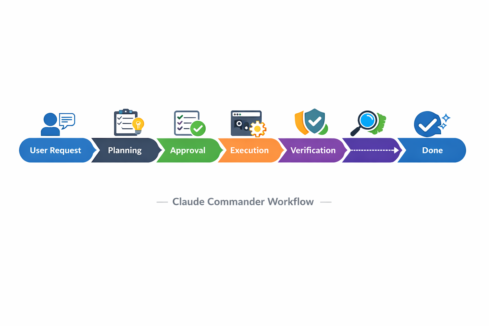

# Claude Commander

[](https://github.com/ClancyDennis/claude-commander/stargazers)
[](LICENSE)


> **Status: Alpha** — Core features work, but expect rough edges. Pipeline system is experimental. Pre-built binaries coming soon.

**Your AI assistant for everything you do on a computer.**

Organize your cloud files. Send emails. Deploy websites. Generate images. Search your messages. Control cloud infrastructure. If you can do it from a terminal, Claude Commander can do it for you — through natural language.


---

## What Can It Do?

| You say... | Claude Commander... |
|------------|---------------------|
| "Organize my OneDrive by project" | Creates folders, moves files, renames intelligently |
| "Send a follow-up email to Sarah" | Connects to Gmail, drafts and sends |
| "Deploy my website to Azure" | Runs deployment commands, monitors status |
| "Generate a logo for my podcast" | Calls OpenAI DALL-E, saves result |
| "Find all messages from Mom about the trip" | Searches iMessage database |
| "Refactor this codebase to TypeScript" | Runs multiple Claude Code agents in parallel |

**Anything you can do from the command line without sudo — Claude Commander can automate.**

---

## Key Features

- **Run many Claude Code agents simultaneously** — parallelize any task across directories
- **Guided instruction files** — walks you through connecting any service (OneDrive, Gmail, Azure, etc.)
- **Automatic security detection** — catches prompt injection and dangerous commands before they run
- **Cost tracking** — see exactly what you're spending across all agents in real-time
- **Human-in-the-loop** — review and approve plans before execution
- **Smart verification** — run the same task with multiple agents and automatically pick the best result


<!--
DEMO GIF NEEDED: demo.gif
Target: 20-30 seconds total, 800x600px, <5MB

RECORDING PLAN (edit clips together):

Clip 1: Create Agent (3-4 sec)
- Press Ctrl+N or click "New Agent"
- Show the dialog appearing

Clip 2: Enter Request (4-5 sec)
- Type: "List all TypeScript files in this project"
- Click Create/Submit

Clip 3: Agent Working (8-10 sec)
- Show agent status changing to "Running"
- Output streaming in real-time
- Tool activity panel showing Glob/Read calls
- Task Progress updating (1/3 → 2/3 → 3/3)

Clip 4: Complete (3-4 sec)
- Status changes to "Completed"
- Final output visible
- Cost shown in corner

EDITING NOTES:
- Speed up waiting periods 2-4x
- Keep typing at normal speed
- Smooth transitions between clips
- No audio needed
-->


---

## Example Use Cases

### For Everyone

- **"Organize my Downloads folder"** — Sorts files by type, renames with dates, moves to appropriate locations
- **"Search my emails for flight confirmations"** — Finds and summarizes travel bookings
- **"Back up my photos to OneDrive"** — Uploads, organizes by date, removes duplicates

### For Developers

- **"Refactor this Python project to use async"** — Runs multiple agents analyzing and updating files in parallel
- **"Set up CI/CD for this repo"** — Creates GitHub Actions workflows, configures deployments
- **"Review these 5 PRs"** — Spawns agents to analyze each PR simultaneously

### For Power Users

- **"Deploy my Next.js app to Azure"** — Handles build, container setup, deployment, DNS
- **"Spin up a Kubernetes cluster on GCP"** — Creates cluster, configures networking, deploys services
- **"Monitor my AWS costs and alert me"** — Sets up cost tracking and notifications

### For Creatives

- **"Generate podcast cover art variations"** — Uses OpenAI DALL-E to create multiple options
- **"Transcribe these interview recordings"** — Processes audio files with Whisper API
- **"Create social media posts from this article"** — Generates platform-specific content

---

## How It Works

### 1. You describe what you want

> "Organize my OneDrive photos by year and remove duplicates"

### 2. Claude Commander creates a plan

The app breaks your request into steps, shows you what it will do, and waits for your approval.

### 3. Agents execute (with safety rails)

Multiple Claude Code agents run the commands. Security monitoring watches for anything suspicious. You can pause or cancel anytime.



---

## Security Model

Claude Commander includes a three-layer security system to protect against malicious commands and prompt injection attacks.

### What's Blocked by Default

| Category | Examples |
|----------|----------|
| **Destructive commands** | `rm -rf /`, `mkfs`, `dd`, format commands |
| **Reverse shells** | `bash -i >&`, `nc -e`, socket connections |
| **Sensitive files** | `/etc/shadow`, `.ssh/`, `.aws/credentials`, private keys |
| **Privilege escalation** | `sudo`, SUID manipulation, sudoers modification |
| **Data exfiltration** | Piping data to `curl`/`wget`, DNS tunneling |

### How Approvals Work

By default, **all actions require human approval** before execution:

1. **You send a request** → Claude Commander analyzes your intent
2. **Plan generated** → You see exactly what will happen
3. **You approve or reject** → Nothing runs without your consent
4. **Execution with monitoring** → Security system watches for anomalies

For advanced users, auto-approval can be enabled for low-risk operations. Critical threats (like `rm -rf`) always require manual review.

### Detection Layers

| Layer | How it works |
|-------|--------------|
| **Pattern matching** | Fast regex rules catch known dangerous commands instantly |
| **LLM semantic analysis** | AI reviews context to catch sophisticated attacks |
| **Expectation tracking** | System learns what tools your task *should* use and flags anomalies |

### What Gets Logged

- All user prompts and agent responses
- Every tool call with full input/output
- File operations (read, write, edit, delete)
- Command executions and network requests
- Security events with risk scores

### API Key Storage

API keys are read from a `.env` file and held in memory only. No keys are transmitted except to their respective APIs.

**Location priority:**
1. `tauri_server/.env` (development — current working directory)
2. `~/.config/claude-commander/.env` (Linux installed app)
3. `~/Library/Application Support/claude-commander/.env` (macOS installed app)
4. `%APPDATA%\claude-commander\.env` (Windows installed app)

**Required variables (choose one or both):**
```bash
ANTHROPIC_API_KEY=sk-ant-...   # For Claude models
OPENAI_API_KEY=sk-...          # For OpenAI models
```

See [CONFIGURATION.md](CONFIGURATION.md) for security settings you can customize.

---

## The Magic: Instruction Files → Skills → Sub-Agents

Want Claude Commander to work with OneDrive, Gmail, or another service? The app guides you through creating an **instruction file** — and then transforms it into reusable components:

```
You write:  onedrive-instructions.md
            ↓
Claude Commander generates:
            ├── skills/onedrive-upload.md
            ├── skills/onedrive-search.md
            ├── subagents/onedrive-organizer.md
            └── .claude.md (task-specific context)
```

**Result:** You describe how to use a service once. Claude Commander remembers forever.

**Included instruction templates:**
- OneDrive — File organization, search, upload/download
- Gmail — Send emails, search inbox, manage labels
- Azure — Container management, deployments
- OpenAI — Generate images, audio, embeddings

---

## Quick Start

### Step 1: Install Claude Code

Claude Commander requires [Claude Code](https://github.com/anthropics/claude-code) to run agents.

**macOS / Linux:**
```bash
curl -fsSL https://claude.ai/install.sh | bash
```

**Windows (PowerShell):**
```powershell
irm https://claude.ai/install.ps1 | iex
```

<details>
<summary>Alternative installation methods</summary>

**Homebrew (macOS/Linux):**
```bash
brew install --cask claude-code
```

**WinGet (Windows):**
```bash
winget install Anthropic.ClaudeCode
```

</details>

### Step 2: Get an API Key

Get your [Anthropic API key](https://console.anthropic.com/) — you'll need this to run agents.

### Step 3: Run Claude Commander

**Pre-built releases** — [(https://github.com/ClancyDennis/claude-commander/releases)](https://github.com/ClancyDennis/claude-commander/releases)
```bash
# Clone and install (requires Node.js 18+ and Rust 1.70+)
git clone https://github.com/ClancyDennis/claude-commander.git
cd claude-commander
npm install

# Configure your API key (for development)
cp .env.example .env
# Edit .env and add: ANTHROPIC_API_KEY=sk-ant-...

# Launch!
npm run tauri dev
```

#### Configuration File Location

| Environment | Location |
|-------------|----------|
| **Development** | `tauri_server/.env` (project root) |
| **Installed App (Linux)** | `~/.config/claude-commander/.env` |
| **Installed App (macOS)** | `~/Library/Application Support/claude-commander/.env` |
| **Installed App (Windows)** | `%APPDATA%\claude-commander\.env` |

Create the directory and `.env` file if it doesn't exist:

```bash
# Linux/macOS
mkdir -p ~/.config/claude-commander
echo "ANTHROPIC_API_KEY=sk-ant-..." > ~/.config/claude-commander/.env

# Or use OpenAI instead
echo "OPENAI_API_KEY=sk-..." > ~/.config/claude-commander/.env
```

### Step 4: Create Your First Pipeline

1. Press `Ctrl+N` to create a new pipeline
2. Type a task: *"List all files in my Documents folder"*
3. Review the plan Claude Commander generates
4. Click **Approve** to execute
5. Watch the agent work in real-time

See [BUILD.md](BUILD.md) for production builds and platform-specific instructions.

---

## Comparison

| Scenario | Without Claude Commander | With Claude Commander |
|----------|--------------------------|----------------------|
| Running 5 agents | 5 VS Code windows, constant alt-tabbing | One dashboard, see all at once |
| Tracking costs | Check Anthropic dashboard manually | Real-time cost tracker in-app |
| Permission prompts | Click "Allow" 50+ times per session | Approve once, run many |
| Coming back later | "Which window was doing what?" | Full history with search |
| Connecting services | Write custom scripts | Guided instruction file setup |

---

## FAQ

**Q: Do I need to know programming to use this?**

No! Describe what you want in plain English. Claude Commander figures out the commands.

**Q: What can it actually do?**

Anything you can do from a terminal without admin/sudo access. That includes file management, cloud services (OneDrive, Gmail, Azure, GCP), image/audio generation, messaging apps, deployments, and more.

**Q: How does it work with services like OneDrive or Gmail?**

Claude Commander guides you through creating an "instruction file" that tells Claude Code how to access that service. The app then generates reusable skills and sub-agents automatically.

**Q: Is it safe? Can it delete my files?**

Built-in security monitoring catches dangerous commands and prompt injection attacks. You can require human approval before any action runs. You stay in control.

**Q: How much does it cost?**

The app is free and open source. You pay for Claude API usage (same rates as using Claude Code directly).

**Q: Does it need Claude, or can I use other AI models?**

It uses **Claude Code** to run agents (required). The supervisory "meta-agent" can use either Claude or OpenAI models.

**Q: Is my data sent to your servers?**

No. Everything runs locally on your machine. The app only communicates with Anthropic/OpenAI APIs directly.

---

## Inspired By

Claude Commander builds on ideas from the AI agent community:

- **[Ralph](https://ghuntley.com/ralph/)** by Geoffrey Huntley — The "Ralphline" pipeline system is directly inspired by his work on structured AI workflows
- **[IndieDevDan's workflows](https://www.youtube.com/@indiedevdan)** — Multi-phase agent patterns and verification approaches
- **[This YouTube walkthrough](https://www.youtube.com/watch?v=-WBHNFAB0OE)** — Configurable pipeline settings inspiration

---

## Documentation

| Document | Description |
|----------|-------------|
| [ARCHITECTURE.md](ARCHITECTURE.md) | Technical internals for developers |
| [CONFIGURATION.md](CONFIGURATION.md) | All settings and options |
| [CONTRIBUTING.md](CONTRIBUTING.md) | How to contribute |
| [BUILD.md](BUILD.md) | Build instructions for all platforms |

---

## Keyboard Shortcuts

| Shortcut | Action |
|----------|--------|
| `Ctrl+N` | New Agent/Pipeline |
| `Ctrl+Shift+$` | Toggle Cost Tracker |
| `Ctrl+P` | Toggle Pool Dashboard |
| `Ctrl+Shift+C` | Open Chat View |
| `Escape` | Close dialogs |

---

## Known Limitations

- Pipeline features are experimental — test incrementally
- Hook server runs on fixed port 19832
- Requires Claude Code to be installed separately

---

## Roadmap

**Shipped:**
- Multi-agent management with real-time output streaming
- 4-phase pipeline system (Planning → Implementation → Testing → Review)
- Security monitoring with prompt injection detection
- Cost tracking across all agents
- Instruction file → Skills → Sub-agents transformation

**In Progress:**
- Pre-built binaries for Windows, macOS, Linux

**Planned:**
- Voice input (STT) — Speak commands using OpenAI Whisper API
- Plugin system for community extensions
- Import/export for instruction files and configurations

---

## Contributing

Contributions welcome! See [CONTRIBUTING.md](CONTRIBUTING.md) for development setup.

**Ways to help:**
- Report bugs and suggest features
- Improve documentation
- Add instruction file templates
- Submit pull requests

---

## License

MIT License — see [LICENSE](LICENSE) for details.

---

**Built with Claude** | **Powered by Tauri + Svelte 5** | **AI-Native Architecture**
